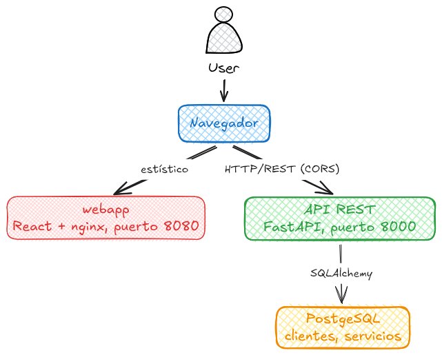

# 1. PRUEBA TÉCNICA DESARROLLO

## DESCRIPCIÓN DEL PROBLEMA

La empresa Celsia Internet S.A.S. requiere implementar una solución para su proceso de venta que permita la captura de información de los clientes y la contratación de uno o varios servicios del portafolio de internet.

El ejercicio consiste en implementar un backend y frontend con su configuración de despliegue en contenedores, para el registro y consulta de la información de los servicios contratados por los clientes, de acuerdo con el modelo de datos presentado a continuación.

## MODELO DE DATOS

Las tablas donde se almacena la información son las siguientes:

```console
CREATE TABLE clientes {
  identificacion VARCHAR(20) NOT NULL PRIMARY KEY,
  nombres VARCHAR(80) NOT NULL,
  apellidos VARCHAR(80) NOT NULL,
  tipoIdentificacion VARCHAR(2) NOT NULL,
  fechaNacimiento DATE NOT NULL,
  numeroCelular VARCHAR(20) NOT NULL,
  correoElectronico VARCHAR(80) NOT NULL
};


CREATE TABLE servicios {
  identificacion VARCHAR(20) NOT NULL,
  servicio VARCHAR(80) NOT NULL,
  fechaInicio DATE NOT NULL,
  ultimaFacturacion DATE NOT NULL,
  ultimoPago INTEGER NOT NUL DEFAULT 0,
  PRIMARY KEY (identificacion, servicio),
  CONSTRAINT servicios_FK1 FOREING KEY (identificacion) REFERENCES clientes(identificacion) ON UPDATE CASCADE ON DELETE NO ACTION
}
```

Para la prueba se deben crear las tablas en el motor de base de datos de su preferencia. Sobre esta base se deben almacenar los registros de los clientes y servicios que se especifican para la prueba.

## Puntos de la prueba

1.1. Implemente en el lenguaje de su preferencia, una `CRUD (Create, Read, Update and Delete)` que permita capturar y administrar la información de los clientes y sus servicios.

1.2. Se deben realizar las siguientes validaciones:

- No dejar datos en blanco.
- El tipo de dato, de acuerdo con la estructura en la base de datos.
- Si el registro ya existe muestre el mensaje `“El registro ya existe”`.

  1.3. Implementar un formulario que permita registrar los servicios contratados de los clientes. `Nota: Tener en cuenta integridad referencial.`

  1.4. Implementar un formulario para la consulta por número de identificación, la información de un cliente y los servicios que tiene contratados.

TIPS:

a. Para el campo `tipoIdentificacion` ingresar solamente los siguientes valores:

- CEDULA → CC
- TARJETA IDENTIDAD → TI
- CEDULA EXTRANJERIA → CE
- REGISTRO CIVIL → RC

b. Para el campo `servicio` ingresar solamente los siguientes tipos:

- Internet 200 MB
- Internet 400 MB
- Internet 600 MB
- Directv Go
- Paramount+
- Win+

c. Se evaluará el uso de patrones de diseño, en backend y frontend, la configuración de despliegue en contenedores y de la imagen a desplegar.

d. En el docker-compose se debe incluir la configuración del servicio de base de datos que haya escogido y una política de manejo de logs para cada servicio.

## ENTREGABLE

Se espera como resultado un clone del repositorio `https://github.com/celsia-internet/pruebas.git`, con la siguiente estructura.

```
api/
|-- docker-compose.yml
|-- Dockerfile
|-- README.md
|-- ...
webapp/
|-- docker-compose.yml
|-- Dockerfile
|-- README.md
|-- ...
```

El repositorio de la prueba deberá estar publicado en `github` de manera pública con el nombre `prueba-celsia-internet` usando git-flow por desarrollador.

```
main/
|-- develop
||-- <desarrollador>
```

# 2. PRUEBA TEORICO-PRACTICA

Para el desarrollo de la prueba teórica, tendrás que escribir tus respuestas en el archivo README.md del repositorio, tomando como referencia la aplicación desarrollada en la `PRUEBA TÉCNICA DE DESARROLLO`.

## PREGUNTAS

2.1. Elabore un diagrama de componentes de la aplicación. Debe cargar el archivo en la siguiente ruta del repositorio: `./assets/diagrama.png`

- RTA: 

  2.2. ¿Qué mecanismos de seguridad incluirías en la aplicación para garantizar la protección del acceso a los datos?

- RTA: Implementaría autenticación y autorización mediante OAuth 2.0/OIDC con tokens de corta duración y RBAC, garantizando que cada usuario solo pueda acceder a los recursos que le corresponden. La API se expondría exclusivamente mediante HTTPS, detrás de nginx, con CORS restringido, rate limiting y cabeceras de seguridad, manteniendo Swagger restringido en producción. En PostgreSQL aplicaría mínimo privilegio, acceso únicamente desde la red interna y cifrado de datos y copias de seguridad cuando corresponda. Finalmente, incorporaría validación estricta de entradas, protección contra XSS/CSRF, auditoría de accesos y modificaciones, gestión segura de secretos y políticas de minimización y conservación de datos personales.

  2.3. ¿Qué estrategia de escalabilidad recomendarías para la aplicación considerando que el crecimiento proyectado será de 1,000,000 de clientes por año?

- RTA: Recomendaría una estrategia de escalabilidad progresiva, partiendo de una arquitectura monolítica y stateless con FastAPI y PostgreSQL, ya que 1.000.000 de clientes al año no requiere inicialmente una arquitectura distribuida. Primero optimizaría la base de datos mediante índices, paginación, pool de conexiones y migraciones controladas, y posteriormente escalaría horizontalmente la API mediante múltiples instancias detrás de un balanceador de carga. Para absorber el crecimiento de las consultas se podrían incorporar réplicas de lectura y, cuando sea necesario, una caché como Redis; el frontend React podría distribuirse mediante un CDN. Para picos de alta demanda, procesos no críticos podrían desacoplarse mediante colas y procesamiento asíncrono. Finalmente, utilizaría monitoreo y pruebas de carga para determinar cuándo incorporar particionamiento o archivado de datos, evitando introducir microservicios o sharding hasta que las métricas demuestren que son necesarios.

  2.4. ¿Qué patrón o patrones de diseño recomendarías para esta solución y cómo se implementarían? (Justifique)

- RTA: Recomendaría aplicar principalmente los patrones **Repository, Service Layer y Dependency Injection** en el backend, y **Facade/Service y Custom Hooks** en el frontend. En FastAPI, los repositorios encapsularían el acceso a PostgreSQL mediante SQLAlchemy, mientras que una capa de servicios concentraría las reglas de negocio y los casos de uso, dejando los routers únicamente como adaptadores HTTP. FastAPI permite implementar Dependency Injection mediante `Depends`, facilitando además las pruebas y la incorporación de autenticación y autorización. En React, mantendría una fachada o cliente HTTP centralizado para gestionar las comunicaciones con la API, mientras que los servicios por funcionalidad y los Custom Hooks encapsularían la lógica de acceso y estado, dejando los componentes enfocados en la presentación. Esta combinación permite separar responsabilidades, facilita las pruebas y el mantenimiento, y permite escalar la aplicación sin introducir complejidad innecesaria como microservicios, CQRS o Event Sourcing mientras el volumen y los requerimientos no lo justifiquen.

  2.5. ¿Qué recomendaciones harías para optimizar el manejo y la persistencia de datos de la aplicación, teniendo en cuenta que esta aplicación tiene una alta transaccionalidad?

- RTA: Para una aplicación con alta transaccionalidad recomendaría optimizar primero la gestión de las transacciones y la concurrencia. En PostgreSQL, la integridad de los datos debe estar respaldada por claves, restricciones y relaciones adecuadamente indexadas, evitando consultas previas innecesarias antes de insertar y manteniendo las transacciones cortas y atómicas. En SQLAlchemy, utilizaría un pool de conexiones correctamente dimensionado y, ante un crecimiento importante de concurrencia, evaluaría SQLAlchemy asíncrono con `asyncpg` y PgBouncer. Para las consultas, implementaría paginación e índices adecuados y utilizaría réplicas de lectura o caché cuando el volumen lo requiera. Finalmente, incorporaría monitoreo de consultas y bloqueos, configuración de `autovacuum`, migraciones mediante Alembic y una estrategia de backups con recuperación a un punto en el tiempo (PITR). De esta manera se mantiene la consistencia de las operaciones y se permite aumentar la capacidad de la aplicación sin comprometer el rendimiento ni la integridad de los datos.

# 3. Redes

3.1. Explica la diferencia entre un router y un switch. ¿Cuándo usarías cada uno?

- RTA:

  3.2. Describe las siete capas del modelo OSI y menciona brevemente la función principal de cada una

- RTA:

  3.3. Explica las diferencias entre los protocolos TCP y UDP. Dar un ejemplo de cuándo usarías cada uno?

- RTA:

  3.4. ¿Qué es una máscara de subred y cómo se utiliza para dividir una red en subredes más pequeñas?

- RTA:

  3.5. ¿Puedes mencionar algunos protocolos de enrutamiento dinámico y explicar brevemente cómo funcionan?

- RTA:

### Por último, y no menos importante, te deseamos mucha suerte y esperamos que disfrutes haciendo la prueba. El objetivo es evaluar tu conocimiento, capacidad de adaptabilidad y habilidad para resolver problemas.
